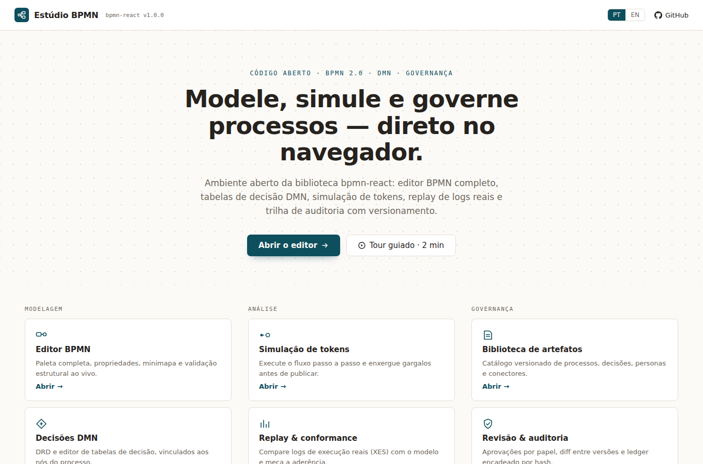

# Estúdio BPMN <sub>(`bpmnPlay`)</sub>

**Modele, simule e governe processos BPMN — direto no navegador.**

Playground aberto da biblioteca [`danzeroum/bpmn`](https://github.com/danzeroum/bpmn) (`@bpmn-react/*`): editor BPMN completo, tabelas de decisão DMN, simulação de tokens, replay de logs reais e trilha de auditoria com versionamento. **100% client-side** — nada é enviado a servidor algum: seus diagramas e logs são processados no seu navegador.

<!-- screenshot: adicionar docs/img/home.png (tela inicial) após o deploy -->


## ✨ O que dá para fazer

| Módulo | Rota | O que faz |
|--------|------|-----------|
| **Editor BPMN** | `/editor` | Paleta completa, propriedades, minimapa e validação estrutural ao vivo |
| **Decisões DMN** | `/dmn` | DRD e editor de tabelas de decisão, vinculados aos nós do processo |
| **Simulação de tokens** | `/simulate` | Execute o fluxo passo a passo e enxergue gargalos antes de publicar |
| **Replay & conformance** | `/replay` | Compare logs de execução reais (XES/CSV) com o modelo e meça a aderência |
| **Biblioteca** | `/library` | Catálogo versionado de processos, decisões, personas e conectores |
| **Studio** | `/studio` | Revisão do aprovador, diff entre versões e ledger de auditoria encadeado por hash |

### Compartilhe diagramas por link

O botão **Compartilhar** comprime o diagrama inteiro no hash da URL (deflate + base64url) — mande o link e a outra pessoa abre exatamente o seu modelo, sem conta, sem upload, sem servidor. Diagramas grandes demais para a URL podem ser exportados como `.bpmn`.

### Traga seus logs reais para o Replay

Arraste um arquivo **`.xes`** ou **`.csv`** para o Replay: o app parseia localmente (web worker para logs grandes), casa os eventos com o modelo e mostra **aderência, desvios e gargalos** — com três visões no canvas (Gargalos · Frequência · Desvios). CSVs passam por um assistente de mapeamento de colunas (caso / atividade / timestamp).

### Exporte para onde precisar

Menu **Arquivo**: BPMN 2.0 (`.bpmn`), modelo JSON (`.json`), trilha de auditoria (`.csv`) e exportação Camunda 8 (experimental, atrás de feature-flag).

### Navegue rápido

**⌘K / Ctrl+K** abre a paleta de comandos: ações, navegação entre módulos e busca de exemplos, com fuzzy search.

## 🚀 Rodando localmente

Requisitos: Node ≥ 20 e `pnpm`.

```bash
# 1. clonar JÁ com o submódulo da biblioteca
git clone --recurse-submodules https://github.com/danzeroum/bpmnPlay.git
cd bpmnPlay

# (se clonou sem --recurse-submodules:)
git submodule update --init --recursive

# 2. buildar a biblioteca do submódulo
pnpm --dir bpmn install
pnpm --dir bpmn -r run build

# 3. instalar e rodar
pnpm install
pnpm dev
```

Abre em **http://localhost:5173**.

### Atualizar a biblioteca

```bash
pnpm run update-lib   # git submodule update --remote + reinstala + rebuilda
pnpm test             # opcional: pega regressões da versão nova
```

Para fixar uma versão específica da biblioteca: entre em `bpmn/`, faça `git checkout <ref>`, rebuilde e commite o novo ponteiro do submódulo. (A troca de versão é uma operação de build — não existe seletor em runtime.)

### Deploy (host estático)

O app usa `BrowserRouter`, então rotas como `/editor` precisam de um host que faça **rewrite de SPA** (todas as rotas → `index.html`). Em plataformas como Vercel/Netlify isso é padrão. No **GitHub Pages** (sem rewrite), o `public/404.html` guarda o path e redireciona para a raiz, onde um script no `index.html` o restaura — nenhuma rota dá 404. O `#` da URL fica reservado para o permalink do diagrama, por isso não se usa `HashRouter`.

## 🖼️ Contribua com um exemplo

A galeria da home é mantida pela comunidade. Para adicionar um processo:

1. Coloque seu arquivo `.bpmn` (ou `.json` do modelo) na pasta **`examples/`**;
2. Siga o [guia de contribuição](CONTRIBUTING.md) (metadados do card: título, descrição, tags);
3. Envie um **pull request** — aprovado, ele aparece na galeria para todo mundo.

## 🔗 Links diretos

- `/#d=<payload>` — diagrama compartilhado (gerado pelo botão Compartilhar)
- `/editor?load=<versionId>` — abre uma versão exata do registry demo (usado pelo "Abrir no Designer" do Studio)
- `?dev=1` — **modo desenvolvedor**: rotas de QA (A\*, stress, elementos fechados, deadlock) e o inspetor de modelo com métricas (nós, arestas, gateways, ciclos, complexidade ciclomática)

## 🧪 Testes

Testes Playwright cobrindo rotas e redirects, permalink (roundtrip, oversize, hash inválido), upload/conformance, visões do replay, Cmd+K, galeria, `?load=` e roundtrip XML dos exemplos:

```bash
pnpm exec playwright install chromium   # só na primeira vez
pnpm test
```

## ⚠️ Limitações conhecidas

Ver [`docs/known-issues.md`](docs/known-issues.md). Destaques:

- O `BpmnXmlConverter` da biblioteca perde filhos de sub-process/pool no roundtrip XML — por isso o **permalink usa JSON lossless**, e o export `.bpmn` avisa quando há perda (bug reportado upstream).
- A exportação Camunda 8 é BPMN 2.0 padrão (a biblioteca ainda não tem conversor Zeebe) — por isso está marcada como experimental.
- `/editor?load=<versionId>` resolve contra o registry demo em memória; após um refresh, versões criadas na sessão do Studio não estão mais lá (comportamento esperado num app sem backend).

## 🗺️ Roadmap (fase 2)

- Tours guiados contextuais por módulo (DMN, Replay, Studio)
- Exportação Camunda 8 real, quando a biblioteca expuser o conversor
- Assistente de modelagem com LLM, opt-in (chave do próprio usuário ou Ollama local — continua sem servidor)

## 📁 Estrutura

```
bpmnPlay/
├── bpmn/                ← submódulo git (a biblioteca @bpmn-react/* — não alterada aqui)
├── docs/
│   ├── design_handoff_bpmnplay_v2/   ← handoff de design do redesign v2
│   └── known-issues.md
├── examples/            ← galeria de exemplos (contribua via PR!)
├── src/                 ← o app (Vite + React + TypeScript)
├── tests/               ← testes Playwright
└── vite.config.ts       ← resolve @bpmn-react/* → bpmn/packages/*/dist/esm
```

## Licença

MIT. A biblioteca `danzeroum/bpmn` tem licenciamento próprio — consulte o repositório dela.
